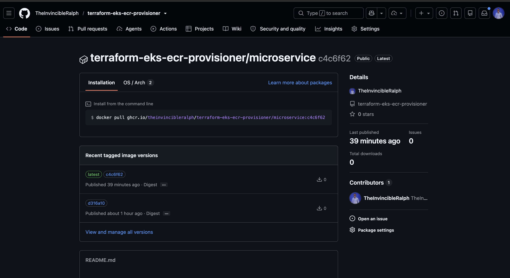
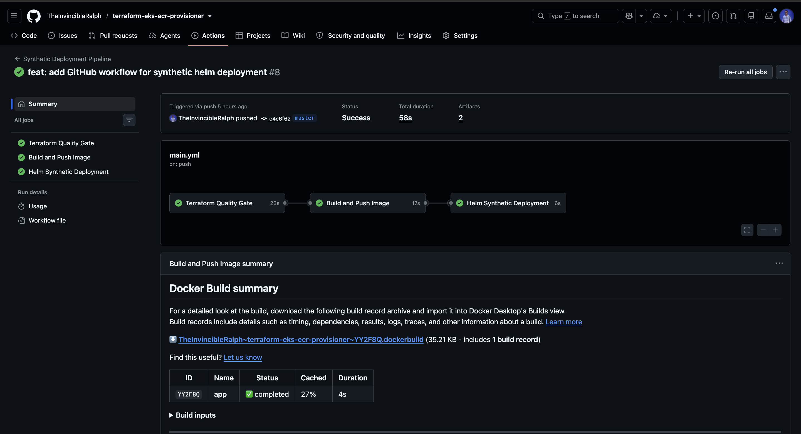

# Terraform EKS & ECR Provisioner

This repository is built to provision a complete Amazon EKS and ECR environment using Terraform, and then automatically validate a sample microservice deployment using Helm and GitHub Actions.

## How the Repository is Organized

- `**.github/workflows/**`: This folder conatins the GitHub Actions workflow that tests the Terraform code in the `terraform/` directory, builds the container, and simulates the Helm deployment.
- `**app/**`: This contains a lightweight Python HTTP server (`main.py`). It acts as a synthetic workload, proving that the Kubernetes routing and Docker containerization work perfectly.
- `**helm/microservice/**`: This holds the Kubernetes manifests. I used a dynamic `values.yaml` file so things like Pod Disruption Budgets, resource limits, and the specific image tags can be injected automatically by the pipeline, keeping the core templates completely generic.
- `**terraform/**`: This folder contains the root AWS orchestration. It provisions a production-ready VPC, spins up the EKS cluster using the official AWS module, and consumes my custom module for the Elastic Container Registry (`modules/ecr/`).

## Pipeline Implementation

### 1. The Terraform Quality Gate

Before any infrastructure is reached, the pipeline runs a formatting check and validates the syntax. It then runs a `terraform plan` to verify exactly what changes will be made to the AWS environment. This ensures broken code never reaches the cloud.

### 2. Building and Pushing the Artifact

Next, the pipeline looks at the `app/` directory, containerizes the Python application, and tags it with the exact Git commit hash (`${{ github.sha }}`). This is crucial for traceability. It then pushes this new Docker image straight to the GitHub Container Registry (GHCR).

### 3. Synthetic Helm Validation

Finally, we need to prove the deployment will work without actually forcing it onto a live production cluster. The pipeline lints the Helm chart to ensure best practices, injects the brand-new image URI it just built, and runs a `helm install --dry-run --debug`. This proves that the Kubernetes API accepts the rendered deployment.

## Design Choices & Best Practices

To make the assessment mirror a real-world production-grade implementation, I made the following decisions:

- **State Locking:** I configured Terraform to use native S3 state locking (`use_lockfile = true`). This prevents race conditions if multiple engineers run the pipeline at the same time.
- **Cluster Resilience:** The Helm chart isn't just a basic deployment. It natively implements Pod Disruption Budgets (PDB) to guarantee the app stays available during node maintenance. It also enforces strict CPU and Memory resource quotas so the Python app can't accidentally consume the whole node.
- **Dynamic Image Injection:** The Helm deployment is fully decoupled from the image tag. By having the CI pipeline inject the exact repository and tag at runtime, the chart remains highly reusable across multiple environments like Dev, Staging, or Prod.
- **Secret Management & Authentication:** For this assessment, I used GitHub Actions Secrets for AWS authentication. While OpenID Connect (OIDC) is the industry standard and would be my approach for production (because it eliminates long-lived credentials), implementing OIDC requires live AWS infrastructure to establish the trust relationship. So since this project focuses on synthetic validation and the Terraform isn't actively applied to a live AWS account, Secrets had to be used.

